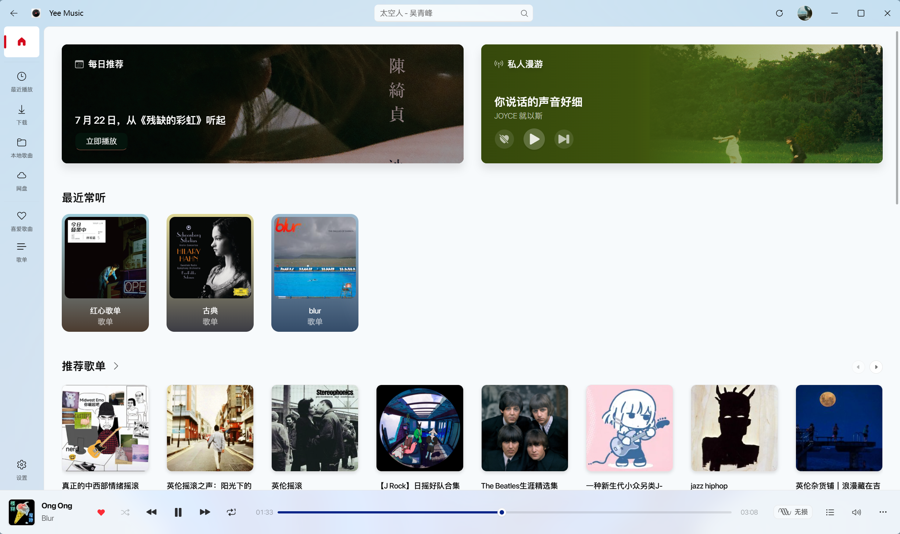
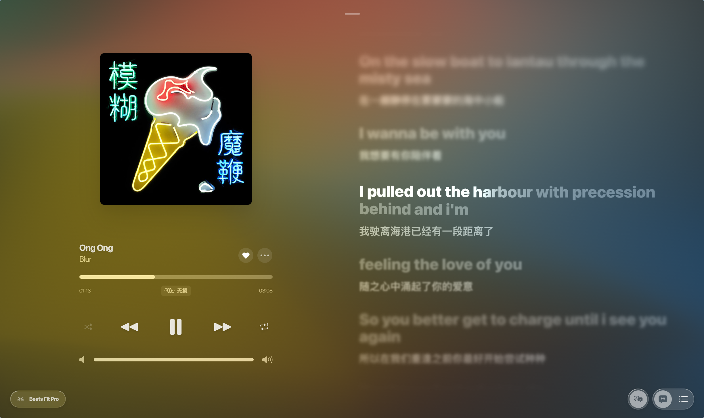
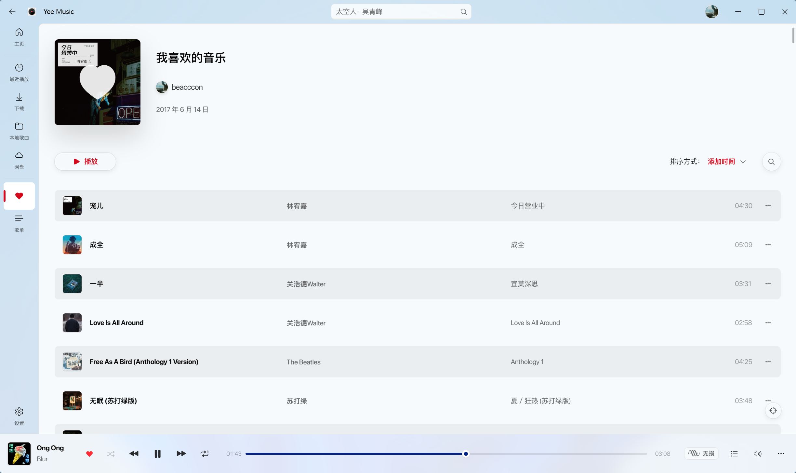
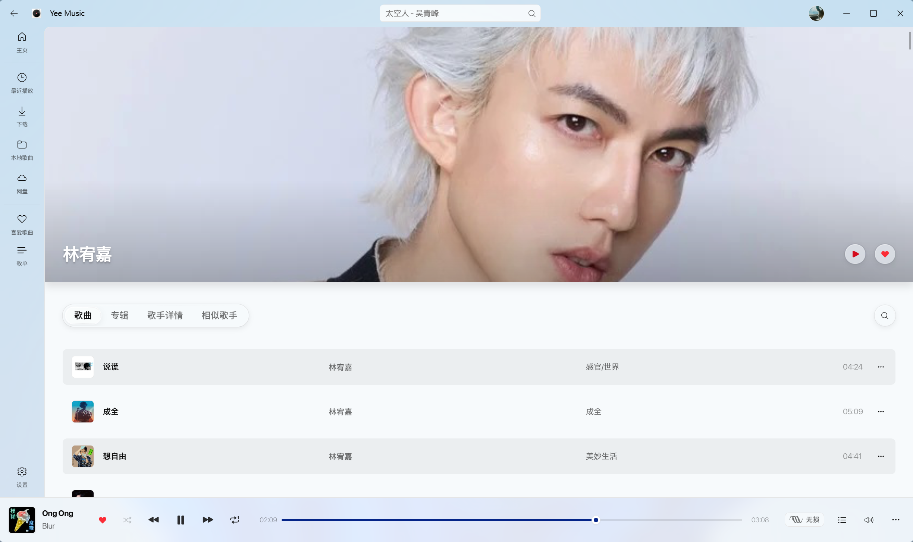
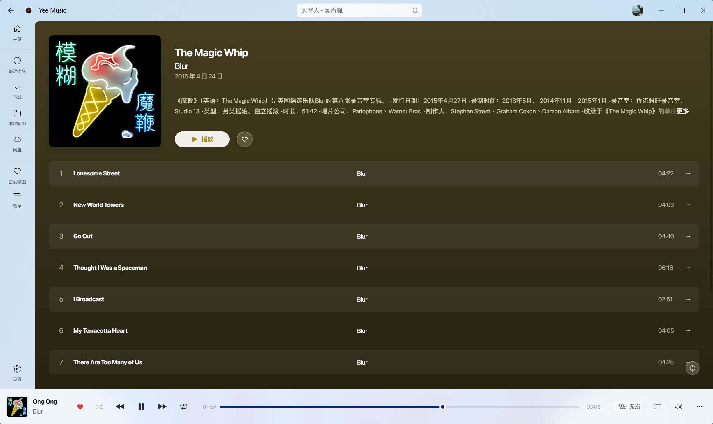
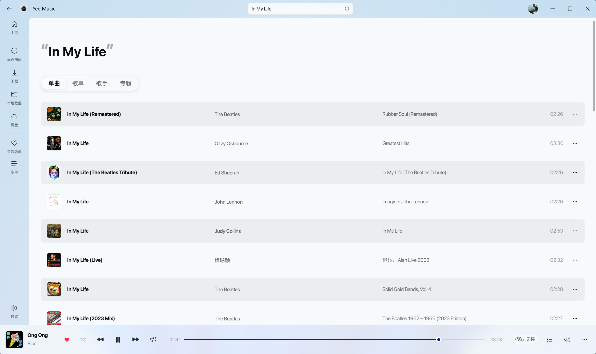
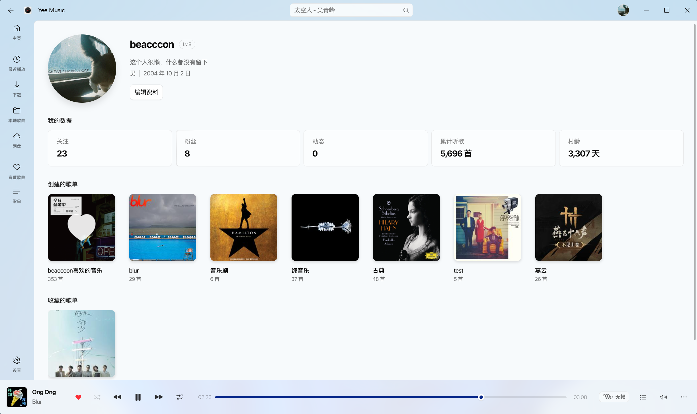
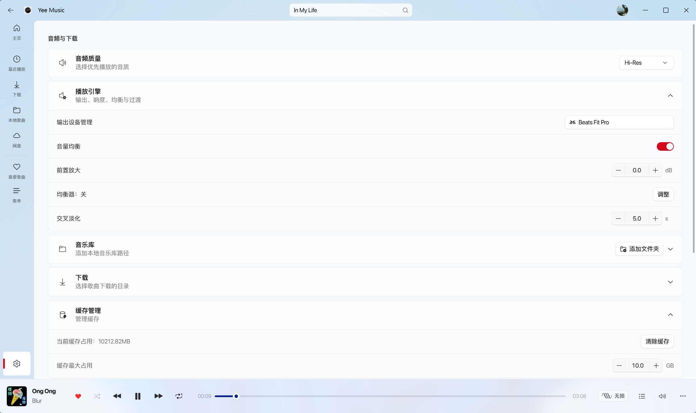

<div align="center">
  <h1>Yee Music</h1>

  
</div>

<div align="center">
  <p>简洁美观的第三方网易云音乐客户端</p>
  <p><strong>优雅、灵动</strong></p>
</div>

<div align="center">
    <a href="https://github.com/1sen3/YeeMusic/releases">
        
      </a>
  
  
  <a href="https://www.gnu.org/licenses/agpl-3.0">
    
  </a>
</div>

> [!IMPORTANT]
> **关于项目维护状态的声明**
>
> 由于本人需要准备考研，本项目将**暂时停止高频维护和新功能开发**。
> 在此期间，我可能无法及时回复 Issue，预计将在 **2026 年 12 月（初试结束后）** 恢复正常维护，请见谅！如果你对本项目感兴趣并有修复 Bug 或优化代码的想法，欢迎随时提交 **PR**。

## 🖼️ 界面展示

<div style="display: flex; flex-wrap: wrap; gap: 10px;">
  
  
  
  
  
  
  
  
</div>
    
## ✨ 功能与特性

- 界面设计深度参考 Fluent UI
- 支持 Win11 原生 Acrylic 与 Mica 效果
- 扫码登录及手机号登录
- 深浅色主题
- 新建、编辑、删除歌单及对歌单添加\删除歌曲
- 收藏歌手、歌单、专辑
- 漫游模式
- 逐字歌词、类 Apple Music 风格歌词滚动动画与流体渐变背景
- 支持全局界面与独立歌词字体配置
- 集成歌词翻译以及罗马音歌词
- 下载歌曲
- 播放本地音乐
- 歌曲缓存管理
- 音乐网盘
- 输出设备管理
- 音量均衡、均衡器、交叉淡化
- 全局快捷键管理

## 🚀 快速开始

在开始之前，请确保你的开发环境已安装 [Rust](https://www.rust-lang.org/tools/install) 和 [Node.js](https://nodejs.org/)。

### 1. 环境要求

- **Node.js**: >= 20
- **Rust**
- **Windows 依赖**: 确保已安装 C++ 生成工具和 Edge WebView2 运行时

### 2. 安装运行

```bash
# 1. 克隆项目
git clone https://github.com/1sen3/YeeMusic.git
cd yee-music

# 2. 安装依赖
pnpm install

# 3. 启动开发环境
pnpm tdev

# 4. 构建
pnpm tbuild
```

## ⚙️ 自定义 API 配置

本项目不直接提供后端服务，如有需要请自行部署 [NeteaseCloudMusicAPI Enhanced](https://github.com/neteasecloudmusicapienhanced/api-enhanced)。

部署好 API 服务后，有两种方式指向你的服务地址：

1. **应用内设置（推荐）**：打开 设置 → 网络 → API 服务，填入你的服务地址，立即生效，无需重新构建；留空则恢复默认地址。
2. **构建时配置**：修改项目根目录 `.env` 中的 `VITE_API_BASE_URL`（或创建 `.env.local` 覆盖，该文件不会被提交），作为应用的出厂默认地址：

```bash
# .env / .env.local
VITE_API_BASE_URL=你的 API 地址
```

## 🛠️ 技术栈

- **核心框架**: React 19, TypeScript, Rust, Tauri 2.0, Vite 7
- **音频**: Rodio
- **UI**: TailwindCSS v4, shadcn/ui
- **视觉与动效**: Framer Motion, Three.js, React Three Fiber, Shaders React
- **状态与数据流**: Zustand, SWR, IndexedDB
- **代码规范与工具链**: Biome, Vitest

## 🎁 致谢

- [tauri](https://github.com/tauri-apps/tauri)
- [NeteaseCloudMusicAPIEnhanced](https://github.com/neteasecloudmusicapienhanced/api-enhanced)
- [shadcn/ui](https://github.com/shadcn-ui/ui)
- [Zustand](https://github.com/pmndrs/zustand)
- [AMLL](https://github.com/amll-dev/applemusic-like-lyrics)

## ⚠️ 声明

- 本项目为本人学习用途的开源项目，仅供学习交流使用。
- 项目中使用的音乐数据及 API 均来自第三方，版权归属于网易云音乐，**请勿用于任何商业用途**。

## 📄 开源协议

本项目基于 [GNU Affero General Public License v3.0](./LICENSE) 协议开源。

- 你可以自由地使用、复制、修改和分发本项目的代码（包括商业用途）。
- 请在使用、分发时保留原作者的版权声明和许可声明。
- 如果你修改了本项目，或者基于本项目创建了衍生作品并进行分发，你的衍生项目**必须**以相同的 **AGPL-3.0** 协议开源，并公开完整源代码。
